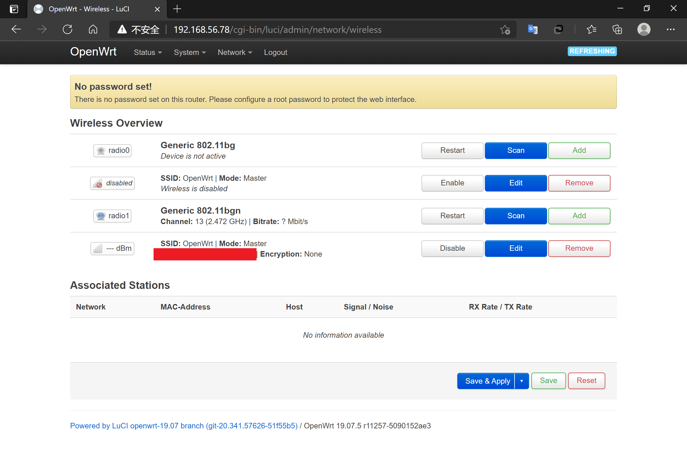
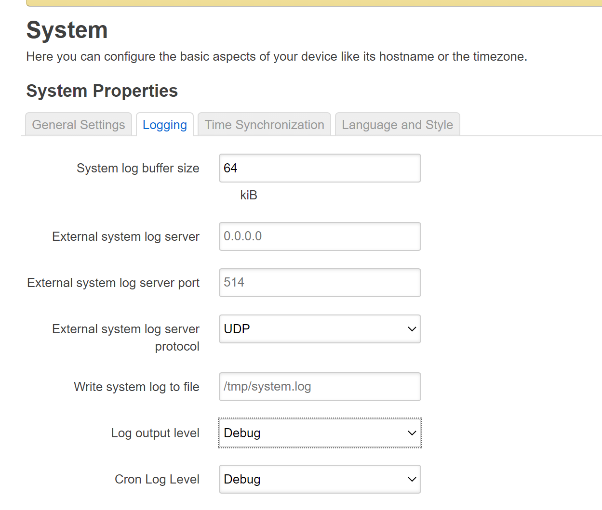

# 无线网络安全基础 课后作业+实验

- [无线网络安全基础 课后作业+实验](#无线网络安全基础-课后作业实验)
  - [实验目的](#实验目的)
  - [实验环境](#实验环境)
  - [实验要求](#实验要求)
  - [实验流程](#实验流程)
    - [**OpenWrt虚拟机的安装**](#openwrt虚拟机的安装)
    - [**OpenWrt配置与无线网卡的连接**](#openwrt配置与无线网卡的连接)
    - [**无线路由器/无线接入点（AP）配置**](#无线路由器无线接入点ap配置)
  - [实验中遇到的问题](#实验中遇到的问题)
    - [**WSL2，AndroidStudio，VirtualBox关于hyper-v的兼容性问题**](#wsl2androidstudiovirtualbox关于hyper-v的兼容性问题)
    - [**系统报错：USB端口上的电涌 所需电量超出该端口所能提供的电量**](#系统报错usb端口上的电涌-所需电量超出该端口所能提供的电量)
    - [**安装并配置好之后，Network-Wireless没有实验所示模式选择，Enable后无法使用。**](#安装并配置好之后network-wireless没有实验所示模式选择enable后无法使用)
  - [致谢](#致谢)

## 实验目的

* 熟悉基于 OpenWrt 的无线接入点（AP）配置
* 为第二章、第三章和第四章实验准备好「无线软 AP」环境

## 实验环境
- VirtualBox 6.1.18
- WSL2 Ubuntu 20.04 Server
- OpenWrt 19.07.5
- 可以开启监听模式、AP 模式和数据帧注入功能的 USB 无线网卡：Atheros AR9271


## 实验要求

- [x] 对照 [第一章 实验](exp.md) `无线路由器/无线接入点（AP）配置` 列的功能清单，找到在 OpenWrt 中的配置界面并截图证明；
- [x] 记录环境搭建步骤；
- [x] 如果 USB 无线网卡能在 `OpenWrt` 中正常工作，则截图证明；
- [x] 如果 USB 无线网卡不能在 `OpenWrt` 中正常工作，截图并分析可能的故障原因并给出可能的解决方法。


## 实验流程

### **OpenWrt虚拟机的安装**

以前配置过WSL2 Ubuntu 20.04环境，所以可以运行黄大提供的代码，但是Mac环境到Linux需要进行一些更改，更改要点如下：
```bash
# 设置的环境变量带了后缀，vim批量替换即可
- VBoxManage
+ VBoxManage.exe
# vboxnet0是Mac环境下的网卡，更改为VirtualBox Host-Only Ethernet Adapter。
- VBoxManage.exe modifyvm "$VM" --nic1 "hostonly" --nictype1 "82540EM" --hostonlyadapter1 "vboxnet0"
+ VBoxManage.exe modifyvm "$VM" --nic1 "hostonly" --nictype1 "82540EM" --hostonlyadapter1 "VirtualBox Host-Only Ethernet Adapter"
# 需要转换一下换行符
$ dos2unix file
```

详细代码及单行注释见：[Setup-VM](code/setup-vm.sh)


安装好的虚拟机配置如下：


启动虚拟机并修改 `/etc/config/network`，更改的地址要在 `VirtualBox Host-Only Ethernet Adapter` 允许的范围内。

```bash
config interface 'lan'
option type 'bridge'
option ifname 'eth0'
option proto 'static'
- option ipaddr '192.168.1.1' 
+ option ipaddr '192.168.56.78' 
option netmask '255.255.255.0'
option ip6assign '60'
```

配置完后重启 `ifdown lan && ifup lan` （此处与课本网卡名称略有不符）。


之后就可以使用ssh连接到虚拟机了。


### **OpenWrt配置与无线网卡的连接**

```bash
# 安装 Luci 软件包与查看 USB 设备信息的工具
opkg update && opkg install luci usbutils

# 检测并安装显卡驱动
# 查看 USB 外设的标识信息
lsusb
# Bus 002 Device 001: ID 1d6b:0003 Linux Foundation 3.0 root hub
# Bus 001 Device 004: ID 0cf3:9271 Qualcomm Atheros Communications AR9271 802.11n
# Bus 001 Device 001: ID 1d6b:0002 Linux Foundation 2.0 root hub

# 查看 USB 外设的驱动加载情况
lsusb -t
# /:  Bus 02.Port 1: Dev 1, Class=root_hub, Driver=xhci_hcd/6p, 5000M
# /:  Bus 01.Port 1: Dev 1, Class=root_hub, Driver=xhci_hcd/8p, 480M
#     |__ Port 1: Dev 4, If 0, Class=Vendor Specific Class, Driver=, 480M

# 快速查找可能包含指定芯片名称的驱动程序包
opkg find kmod-* | grep 9271
# kmod-ath9k-htc - 4.14.209+4.19.137-1-2 - This module adds support for wireless adapters based on Atheros USB AR9271 and AR7010 family of chipsets.
# 也可以搜索 openwrt 支持哪些无线网卡驱动
opkg find kmod-* | grep wireless

# 安装后就可以检测到驱动了
```


```bash
# 让 OpenWrt 支持 WPA 系列更安全的无线安全机制
opkg install hostapd wpa-supplicant
```

这个时候可以登录Web端查看了。


按照课本的说明，更改无线网络的详细配置。
> - 无线网络的详细配置界面里的 Interface Configuration 表单里 Network 记得勾选 wan ；
> - 虚拟机的 WAN 网卡对应的虚拟网络类型必须设置为 NAT 而不能使用 NatNetwork ，无线客户端连入无线网络后才可以正常上网。
> - 不要使用 Auto 模式的信道选择和信号强度，均手工指定才可以。


保存后启用即可正常运行。如果出现了无法连接的问题重启即可解决。



打开手机Wifi，可以接入一个名称为 `OpenWrt` 的无线网络，此时 `Wireless - Assiciated Stations` 增加了一个设备。 


此时手机可以正常连接互联网。


### **无线路由器/无线接入点（AP）配置**
* 重置和恢复AP到出厂默认设置状态
  
  可以直接在Web界面里设置（图示红色按钮）。也可以使用如下指令。
  
  ```bash
  $ firstboot & reboot now
  ```

  （然后你装了半天的环境就没了

* 设置AP的管理员用户名和密码


* 设置SSID广播和非广播模式
  
  
* 配置不同的加密方式

  
* 设置AP管理密码

  
* 配置无线路由器使用自定义的DNS解析服务器 

  

* 配置DHCP和禁用DHCP
  
  

  

  
* 开启路由器/AP的日志记录功能（对指定事件记录）

  
* 配置AP隔离(WLAN划分)功能

  
* 设置MAC地址过滤规则（ACL地址过滤器）
  
* 查看WPS功能的支持情况

  在 `/etc/config/wireless` 中添加
  ```bash
  + option wps_pushbutton '1'
  ```
  

* 查看AP/无线路由器支持哪些工作模式

  

* 使用手机连接不同配置状态下的AP对比实验
* 使用路由器/AP的配置导出备份功能，尝试解码导出的配置文件

  使用 `System/Backup - Generate Archives` 中的备份功能备份文件，下载到本地解压后发现是明文存储密码。

  （注：在vim中运行 `!pwd` ，其中`/mnt`为WSL2中的Windows系统目录，代表此文件在Windows环境下。公开的密码已更改。）
  

  根据品牌搜索解码器未果。（不过都明文了还解什么码...
* 复习VirtualBox的配置与使用
  - 虚拟机镜像列表
  - 设置虚拟机和宿主机的文件共享，实现宿主机和虚拟机的双向文件共享
  - 虚拟机镜像备份和还原的方法
  - 熟悉虚拟机基本网络配置，了解不同联网模式的典型应用场景
  


## 实验中遇到的问题

### **WSL2，AndroidStudio，VirtualBox关于hyper-v的兼容性问题**
做完第五次实验后，我的电脑升级到了专业版，由于第五章实验遗留下的环境开启了 `hyper-v` ，所以出现了 `VirtualBox` 无法打开的现象。但关闭 `hyper-v` 之后出现了 `Android Studio` 无法正常编译到AVD的现象，同时日常使用的 `WSL2-Ubuntu` 彻底无法打开。经搜索各软件对 `hyper-v` 的需求如下。

|软件/子系统|hyper-v需求|
|----|----|
|WSL|WSL不受影响，WSL2需要打开|
|Android Studio|需要打开|
|VirtualBox|6.1版本后可进行虚拟化，之前版本需要关闭|

我目前采用的是 `开启hyper-v + VirtualBox全局虚拟化` 的方法，具体版本号见[实验环境](#实验环境)。

### **系统报错：USB端口上的电涌 所需电量超出该端口所能提供的电量**

起初以为是真的供电问题，通过以下方法解决未果。

- 解除 设备管理器->通用串行总线控制器 中对USB接口的电源限制
- 更换至游戏本和台式机（我理解的可能USB输出功率更大？
- 频繁插拔（舍友和看傻子一样看着我疯狂插拔接口
- 重启虚拟机和重启系统

后来发现每次接入电源后网卡USB连接线与网卡连接插头处迅速发烫，根据电路实验的经验判断是数据线的插头与导线连接部分出现了磨损，买了一根数据线更换后解决。

（然后发现网卡没AP模式...

### **安装并配置好之后，Network-Wireless没有实验所示模式选择，Enable后无法使用。**

相关内容发送在了课程群里并得到了老师的解答。原网卡Realtek RTL-8187 (G_SKY)不支持AP模式。

```bash
    Supported interface modes:
         * IBSS
         * managed
         * monitor
```

更换网卡后可以正常使用了。

同时可以看到[openwrt配置与无线网卡的连接](#openwrt配置与无线网卡的连接)处因为使用过两个设备的原因会出现四个网卡，虽然不影响正常使用但是还是

## 致谢
- [黄大](https://github.com/c4pr1c3) （这次实验贼麻烦老师，跪谢
- [ididChan](https://github.com/ididChan) 
