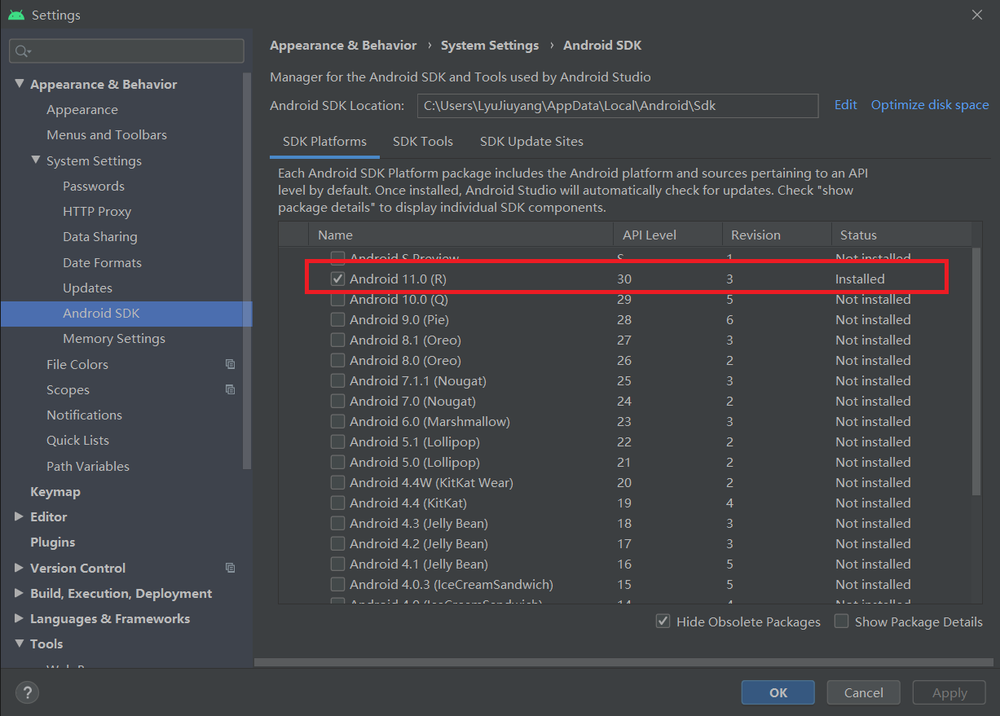
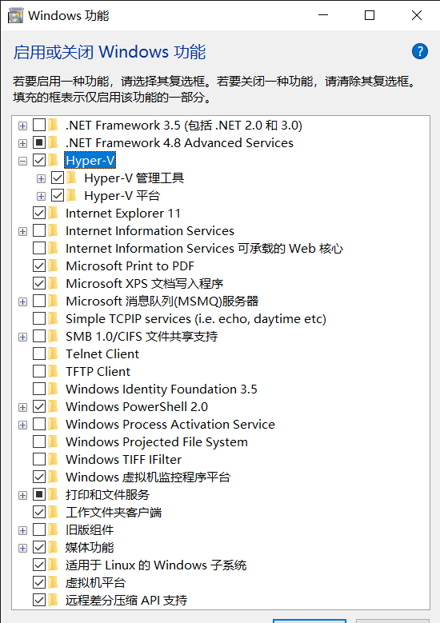
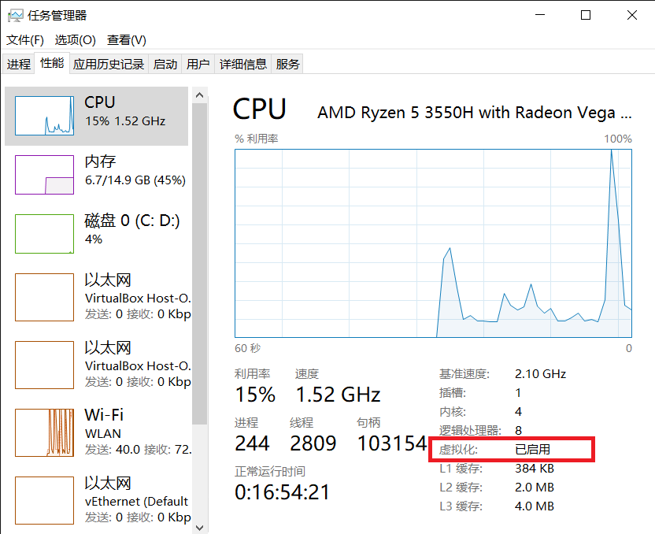
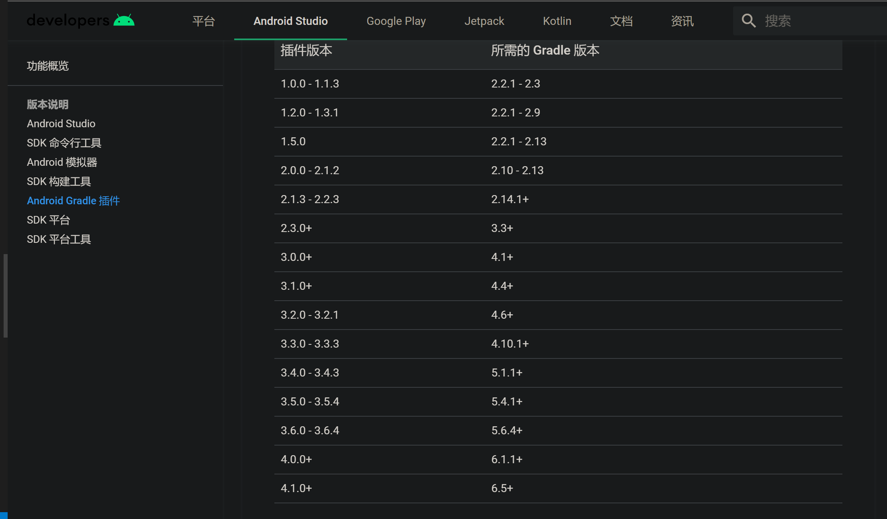

# Android Studio模拟器环境搭建

## 实验要求
- [x] 安装和配置 Java SDK
- [x] 安装Android Studio
- [x] 下载安装 Android SDK
- [x] 配置 Android 模拟器运行环境
- [x] 配置 Gradle 编译环境

## 环境
- CPU：**AMD** Ryzen 5 3550H
- 系统：Windows 10 **家庭版** 1909
- Android Studio 4.1


## 实验步骤

1. 官网下载 Android Studio 安装包进行安装。
2. 使用内置的JDK和SDK。这部分比较简单，基本上就是一直点下去就可以了。安装最后会报一个安装 Intel x86 Atom System 失败的错误，暂时先不用管。（不确定是不是AMD CPU专属问题）

    

3. 开启虚拟化。由于Win10家庭版是没有hyper-v功能的，所以需要进行一些操作。

    在管理员权限下运行
    ```bash
    pushd "%~dp0"
    dir /b %SystemRoot%\servicing\Packages\*Hyper-V*.mum >hyper-v.txt
    for /f %%i in ('findstr /i . hyper-v.txt 2^>nul') do dism /online /norestart /add-package:"%SystemRoot%\servicing\Packages\%%i"
    del hyper-v.txt
    Dism /online /enable-feature /featurename:Microsoft-Hyper-V-All /LimitAccess /ALL
    ```

    重启后发现“程序与功能”中出现了hyper-v功能，勾选该选项。

    

    然后就可以查看是否开启了虚拟化。如果未开启在BIOS里面设置一下就可以了。

    


    可以在右下角看到虚拟化已开启。

4. 配置 Android 模拟器运行环境。

    > 在 PC / Mac 上运行 Android 模拟器强烈建议必须安装 Intel x86 Emulator Accelerator (HAXM installer)，并且配合使用 ABI 类型为 x86/x86_64 的模拟器以获得最流畅的模拟器使用体验。 ——黄大的实验原文

    然而AMD的CPU天生安装不上Intel家的HAXM（/摔）。好在2019年10月之后的AS可以安装AMD的模拟器。在图示位置。

    

    （关于Android Studio的其他版本，我之前写过[另一个解决方案](另一种安装方式.md)，使用Genymotion + VirtualBox + Android Studio，不作为本次实验报告内容。）

    接下来启动AVD管理器，创建一个虚拟设备。这个时候问题又来了。前面我们说到 Intel x86 Atom System 安装失败了，所以这里的第一个镜像需要手动点开提示的网址下载到SDK目录，后续的就可以自动安装了。

    我安装了一个带GooglePlay的镜像和一个不带的。显示如下。

    

    之后运行就可以了。下图是在Pixel4和Pixel_3a_XL上的运行截图。

    

    

5. 配置 Gradle 编译环境

    当前的gradle版本如下：（插件版本4.1.0，gradle版本6.5）

    

    顺便给出官网的插件和内置版本对应。

    

    我使用的内置gradle。这里也简单说一下原理，方便手动安装。

    ```bash
    # gradle-wrapper.properties
    # Wed Mar 10 08:32:40 CST 2021
    distributionBase=GRADLE_USER_HOME
    distributionPath=wrapper/dists
    zipStoreBase=GRADLE_USER_HOME
    zipStorePath=wrapper/dists
    distributionUrl=https\://services.gradle.org/distributions/gradle-6.5-all.zip
    ```

    project要哪个版本的gradle就去zip目录下找，如果没有找到再去url里下载。手动安装的话直接安装到wrapper/dists路径下，然后在 `build.gradle` 里面指定一下gradle版本就好了。

## 问题：Unable to find valid certification path to requested target

StackOverflow上所有解决方案都无效，包括但不限于导入证书、更改配置文件、更改代理、重启并清除缓存。

最终解决方案：一直点Run点到没有报错为止...（史上最奇怪的解决方案）

（如果助教师姐或者老师看到了这条可否解答一下这是什么操作？😂

## 参考

- [Stackoverflow - Android Studio - Unable to find valid certification path to requested target](https://stackoverflow.com/questions/26697118/android-studio-unable-to-find-valid-certification-path-to-requested-target)
- [Stackoverflow - Unable to find valid certification path to requested target - error even after cert imported](https://stackoverflow.com/questions/9210514/unable-to-find-valid-certification-path-to-requested-target-error-even-after-c)
- [Stackoverflow - Unknown error for Google APIs Intel x86 Atom System Image (Android Studio)](https://stackoverflow.com/questions/37369775/unknown-error-for-google-apis-intel-x86-atom-system-image-android-studio/45037280#45037280)
- [Microsoft - 在 Windows 10 上安装 Hyper-V](https://docs.microsoft.com/zh-cn/virtualization/hyper-v-on-windows/quick-start/enable-hyper-v)
- [Google - Android Emulator Hypervisor Driver for AMD Processors - Canary SDK Package, Install Instructions](https://androidstudio.googleblog.com/2019/10/android-emulator-hypervisor-driver-for.html)
- [知乎 - 如何通俗地理解 Gradle？](https://www.zhihu.com/question/30432152)