# 安卓系统访问控制策略与机制

- [安卓系统访问控制策略与机制](#安卓系统访问控制策略与机制)
  - [实验环境](#实验环境)
  - [ADB实验](#adb实验)
    - [命令行](#命令行)
    - [Activity Manager (am)](#activity-manager-am)
    - [软件包管理器 (pm)](#软件包管理器-pm)
    - [其他adb实验](#其他adb实验)
  - [构建第一个 Android 应用](#构建第一个-android-应用)
    - [要回答的问题](#要回答的问题)
  - [HelloWorld v2](#helloworld-v2)
    - [要回答的问题](#要回答的问题-1)
  - [遇到的问题](#遇到的问题)
  - [参考](#参考)

注：本次所有GIF都已经尽量进行压缩，大小在1MB~2.5MB之间，同时提供Gitee备用链接。

## 实验环境

- Android Studio 4.1
- AVD: 
   - `Android 10.0 API 29 x86 - Pixel XL`  
   - `Android 9.0 API 28 x86 - Pixel 3a XL`

## ADB实验
### 命令行
```bash
# 查看开启的模拟器
adb devices

# 连接模拟器终端
adb -s emulator-5554 shell

# 输出环境变量
echo $PATH

# 查看系统版本，lsb_release -a 不可用
uname -a

# 查看当前目录下文件
ls

# 查看防火墙规则
iptables -nL
```

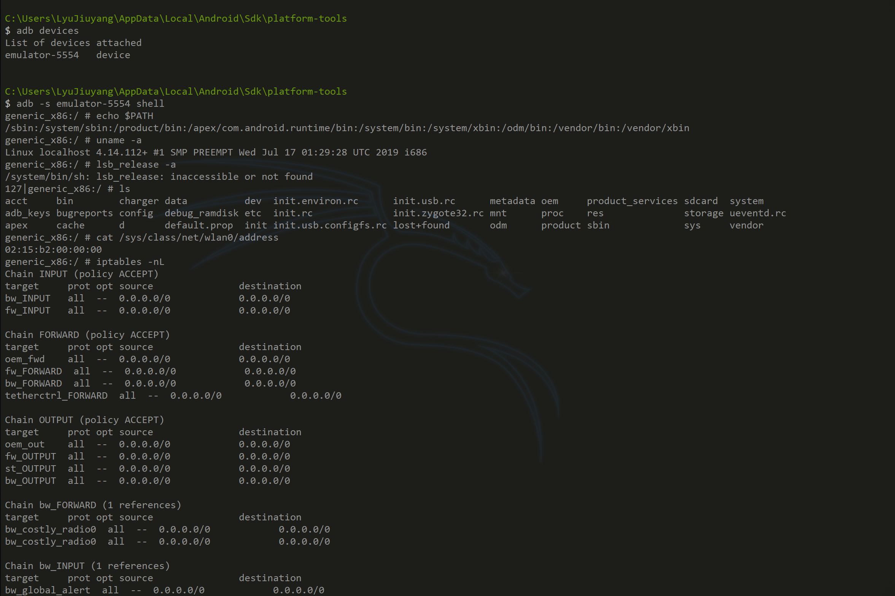

```bash
# 将文件复制到设备/从设备复制文件
adb pull remote local
adb push local remote
```

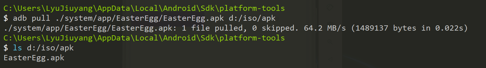

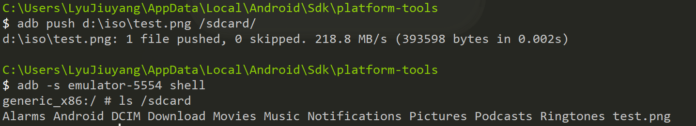

```bash
# 安装应用
adb install path_to_apk
```

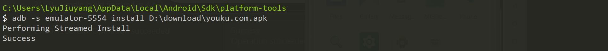

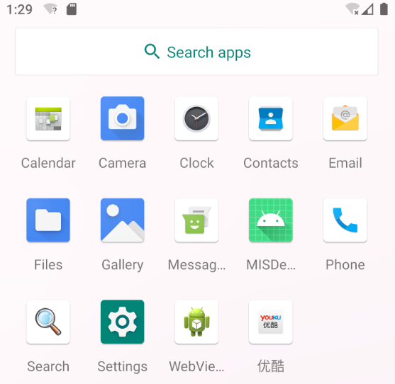

### Activity Manager (am)

```bash
# Camera（照相机）的启动方法为: （Android 10.0 API 29 经测试不可用）
am start -n com.android.camera/com.android.camera.Camera

# Browser（浏览器）的启动方法为：（Android 10.0 API 29 经测试不可用）
am start -n com.android.browser/com.android.browser.BrowserActivity

# 启动浏览器 :
am start -a android.intent.action.VIEW -d  http://sec.cuc.edu.cn/

# 拨打电话 :
am start -a android.intent.action.CALL -d tel:10086

# 发短信：
adb shell am start -a android.intent.action.SENDTO -d sms:10086 --es sms_body ALOHA! --ez exit_on_sent true
```

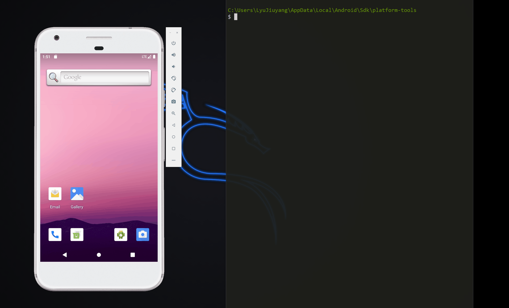

[备用链接](https://gitee.com/lyulumos/Image-Hosting-Site/blob/master/AM.gif)

### 软件包管理器 (pm)

```bash
# 语法为 pm command，这里我们随便使用两个例子

# 查看第三方软件包
pm list packages -3

# 卸载指定软件包
pm uninstall PACKAGE_NAME
```

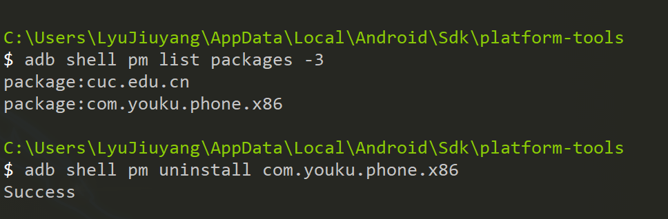

### 其他adb实验

```bash
# 初始状态：AM的发送短信部分

# 回车按下，即换行
adb shell input keyevent 66
# 输入文本
adb shell input text ahahahah
# 焦点去到发送键
adb shell input keyevent 22
# 物理返回键，此处对应效果为 退出键盘输入
adb shell input keyevent 4
# 物理HOME键
adb shell input keyevent 3
```

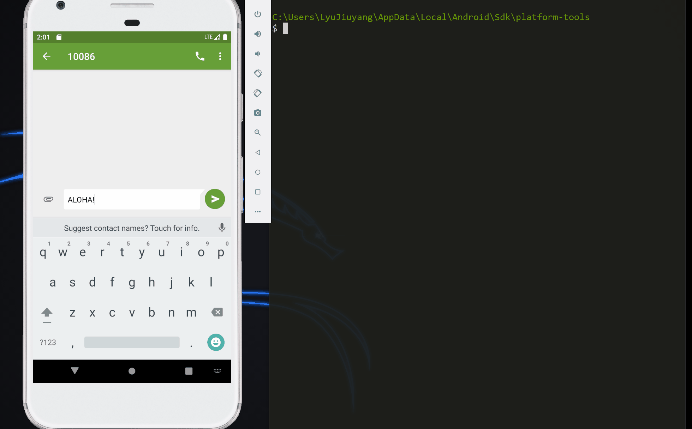

[备用链接](https://gitee.com/lyulumos/Image-Hosting-Site/blob/master/OtherAdb.gif)

## 构建第一个 Android 应用

根据 [Android - FirstApp](https://developer.android.google.cn/training/basics/firstapp) 给出的指示一步一步进行操作。代码在[这里](code/MISDemo/)。

稍有不同的是，

```java
[-] EditText editText = (EditText) findViewById(R.id.editTextText);
[+] EditText editText = (EditText) findViewById(R.id.editTextTextPersonName);
```

最终效果：

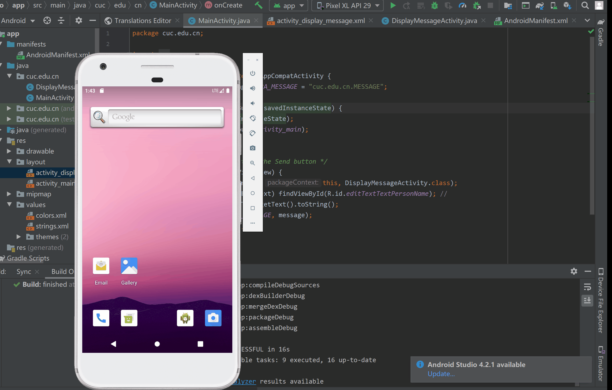

[备用链接](https://gitee.com/lyulumos/Image-Hosting-Site/blob/master/FirstApp.gif)

### 要回答的问题

- [x] 按照向导创建的工程在模拟器里运行成功的前提下，生成的APK文件在哪儿保存的？

    `${MODULE_NAME}/app/build/outputs/apk/debug/`

    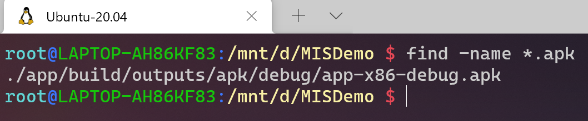
- [x] 使用adb shell是否可以绕过MainActivity页面直接“唤起”第二个DisplayMessageActivity页面？是否可以在直接唤起的这个DisplayMessageActivity页面上显示自定义的一段文字，比如：你好移动互联网安全

    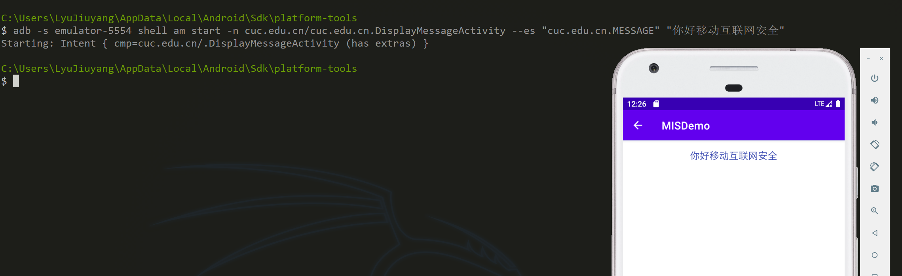
- [x] 如何实现在真机上运行你开发的这个Hello World程序？

    官网给出了[方法](https://developer.android.com/training/basics/firstapp/running-app)但是根据实测，部分步骤在我的手机上可省略。

    1. 打开开发者选项，启动USB调试。这里要注意，在我的手机系统中（MagicUI或EMUI），需要先启动「仅充电状态下允许USB调试」再启动 「USB调试」，**顺序不可以颠倒**。
    2. 选择对应的Android系统环境，直接在真机上运行。（还可以使用分屏模式运行）

    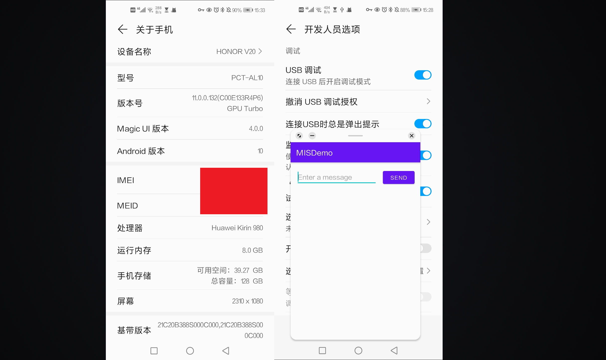

    当然也可以把 `apk` 文件传输至手机，效果一样。


- [x] 如何修改代码实现通过 `adb shell am start -a android.intent.action.VIEW -d http://sec.cuc.edu.cn/ `可以让我们的 `cuc.edu.cn.misdemo` 程序出现在“用于打开浏览器的应用程序选择列表”？


    ```java
    // [+] in MISDemo\app\src\main\AndroidManifest.xml
    <action android:name="android.intent.action.VIEW" />
    <category android:name="android.intent.category.DEFAULT" />
    <category android:name="android.intent.category.BROWSABLE" />
    <data android:scheme="http" />
    <data android:scheme="https" />
    ```

    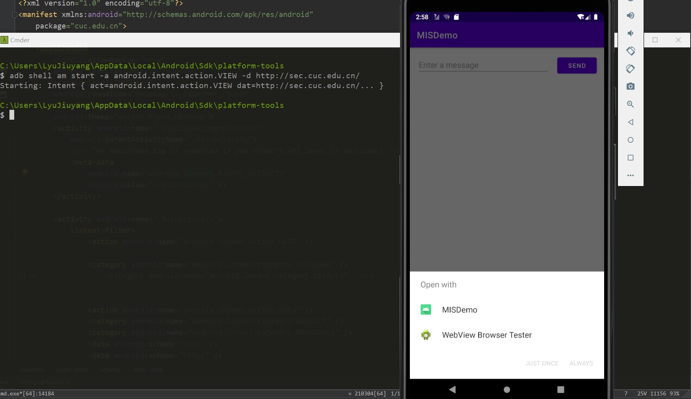

- [x] 如何修改应用程序默认图标？

    在 `res/mipmap` 下新建 Image Assert，我选择的是换个颜色直接覆盖原图，精细化修改可以修改 `AndroidManifest.xml/android:icon, android:roundIcon`。

    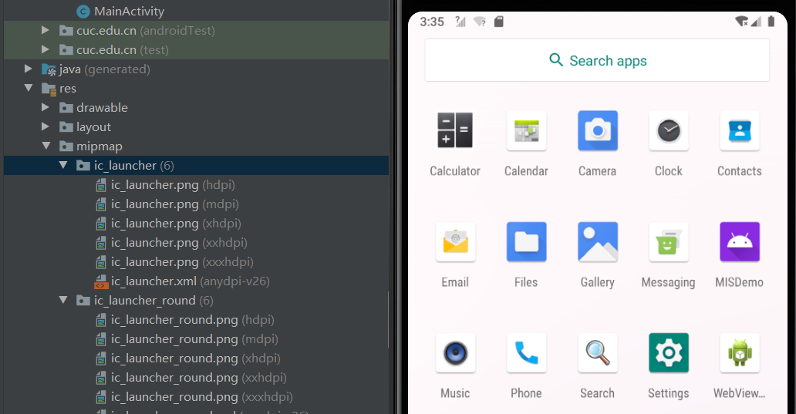

- [x] 如何修改代码使得应用程序图标在手机主屏幕上实现隐藏？


    安卓官网关于Android 10隐藏图标有特殊说明，简单来说就是，我们的程序只能在Android 10上实现 `透明图标` 而不是 `隐藏图标`。

    > As of Android Q, at least one of the app's activities or synthesized activities appears in the returned list unless the app satisfies at least one of the following conditions:
    >
    > - The app is a system app.
    >- The app doesn't request any permissions.
    >- The app doesn't have a launcher activity that is enabled by default. A launcher activity has an intent containing the ACTION_MAIN action and the CATEGORY_LAUNCHER category.

    所以我换了个模拟器hhh。


    ```java
    // protected void onCreate(Bundle savedInstanceState) { ...
    [+] PackageManager packageManager = getPackageManager();
    [+] packageManager.setComponentEnabledSetting(getComponentName(), PackageManager.COMPONENT_ENABLED_STATE_DISABLED, PackageManager.DONT_KILL_APP);
    ```

    实现的效果略有延迟。
  
    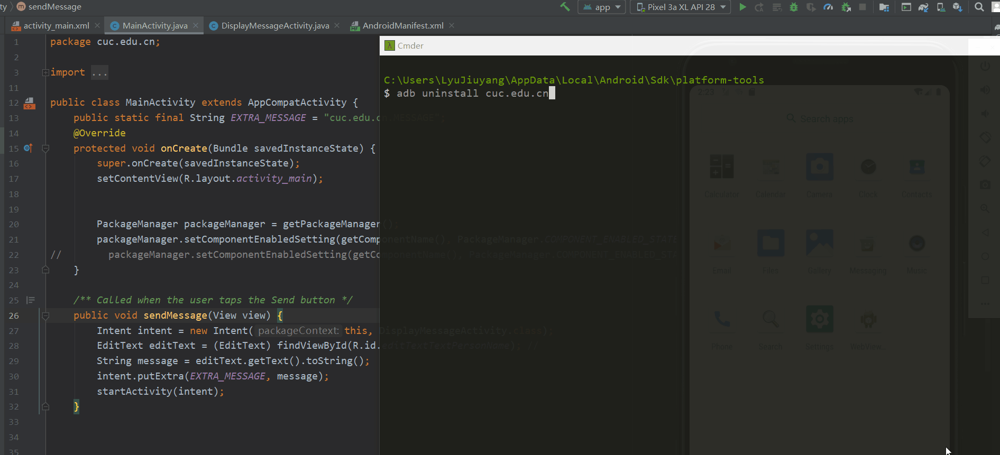

    [备用链接](https://gitee.com/lyulumos/Image-Hosting-Site/blob/master/HideMark.gif)


## HelloWorld v2

在v1基础之上，我们增加以下新功能来为后续的程序逆向和组件安全实验做一些“标靶”
- 使用 `SharedPreferences` 持久化存储小数据并按需读取
- 实现一个简单的注册码校验功能

按照黄大的课本操作就可以了。


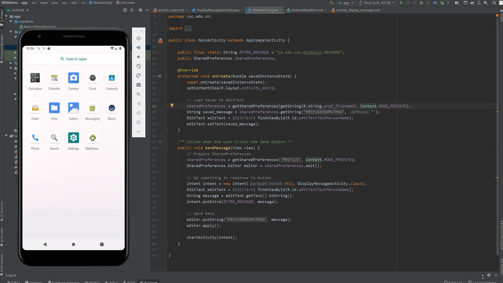

### 要回答的问题

- `DisplayMessageActivity.java` 中的2行打印日志语句是否有风险？如果有风险，请给出漏洞利用示范。如果没有风险，请给出理由。

    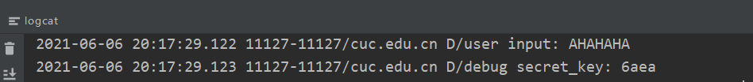

    有风险，用户输入以明文形式暴露可能会泄露重要信息，公布md5结果前4位会降低破解难度。对于更高深的漏洞利用没有什么思路。有一种说法是利于「插桩」分析程序，但是我还没有理解清楚。我理解的「插桩」类似于写代码时的「输出中间变量」方便进行调试，但是我不理解这样对于拆包分析有什么用，还望老师和师姐指点。

- `SharedPreferences` 类在进行读写操作时设置的 `Context.MODE_PRIVATE` 参数有何作用和意义？还有其他可选参数取值吗？

    
  - **MODE_PRIVATE**：默认操作模式，代表该文件是私有数据，只能被应用本身访问，在该模式下，写入的内容会覆盖原文件的内容。
  - **MODE_APPEND**：检查文件是否存在，存在就把新写入的内容追加到原文件中，否则就创建新文件
  - **MODE_WORLD_READABLE** (Deprecated in API level 17)：表示当前文件可以被其他应用读取
  - **MODE_WORLD_WRITEABLE** (Deprecated in API level 17)：表示当前文件可以被其他应用写入


## 遇到的问题


- 绝大部分的操作和问题都可以在 [开发者文档](https://developer.android.google.cn/studio/intro) 中找到解决方案。
- `Error type 3 - Activity class {...} does not exist.`

    偶然会遇到这种错误，是因为此次运行直接覆盖上次运行的APP中间某个过程出错。解决方案来自于参考3。
    ```bash
    adb uninstall packagename 
    ```

    当然这种方法只针对我遇到的错误有效，要是输错class名称这种错误也会这样报错，解决方案根据原因而定。

## 参考

- [黄大 - 移动与互联网安全 - 第六章实验](https://c4pr1c3.gitee.io/cuc-mis/chap0x06/exp.html)
- [Google - Android Studio开发者文档](https://developer.android.google.cn/studio/intro)
- [StackOverflow - Error type 3 - Activity class does not exist](https://stackoverflow.com/questions/41909487/error-type-3-activity-class-does-not-exist)
- [StackOverflow - INSTALL_FAILED_NO_MATCHING_ABIS: Failed to extract native libraries, res=-113](https://stackoverflow.com/questions/36414219/install-failed-no-matching-abis-failed-to-extract-native-libraries-res-113)
- [StackOverflow - ADB Shell Input Events](https://stackoverflow.com/questions/7789826/adb-shell-input-events)
- [Lindroy - CSDN - 对于android.intent.action.MAIN和android.intent.category.LAUNCHER的理解](https://blog.csdn.net/lindroid20/article/details/51993247/)