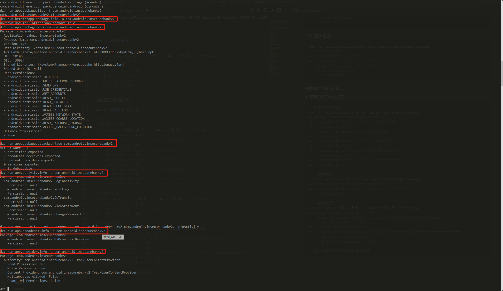

# 基于drozer的Android 缺陷应用漏洞攻击子实验

- [基于drozer的Android 缺陷应用漏洞攻击子实验](#基于drozer的android-缺陷应用漏洞攻击子实验)
  - [安装](#安装)
  - [步骤](#步骤)
    - [1. 显示出手机中的所有包名，明确攻击对象](#1-显示出手机中的所有包名明确攻击对象)
    - [2. 了解攻击对象的详细信息](#2-了解攻击对象的详细信息)
    - [3. 识别攻击面](#3-识别攻击面)
    - [4. 查看详细的攻击面](#4-查看详细的攻击面)
    - [5. 根据具体的攻击面进行攻击](#5-根据具体的攻击面进行攻击)
  - [尝试修复](#尝试修复)

## 安装

- 根据官方在GitHub提供的[下载页面](https://github.com/mwrlabs/drozer/releases/)进行下载，我选择的是win32 msi文件。
  
    

- 下载 [python2](https://www.python.org/downloads/release/python-2718/)。由于Drozer整个代码都是基于Python 2的，使用 python3/pip3 将会报错。之后需要将 python2 路径设为环境变量。
- 将 drozer-agent 下载到AVD上。并在手机上启动，可以单击最下面的状态栏查看当前Server的状态。
  
  ```bash
  adb install drozer-agent-2.3.4.apk
  ```

- 转发端口

  ```bash
  adb forward tcp:31415 tcp:31415
  ```
- 连接模拟器
  
  ```bash
  drozer console connect
  ```

  执行这一步时会出现大量的报错，主要是缺少环境导致的，需要先安装[需要的包](code/requirements.txt)。然后就可以正常连接了。

  ```python
  pip2 install -r requirements.txt
  ```

  

## 步骤

### 1. 显示出手机中的所有包名，明确攻击对象

```bash
dz> run app.package.list
# 输出太长了，这里省略
```

也可以搜索特定的包

```bash
dz> run app.package.list -f com.android.insecurebankv2
# com.android.insecurebankv2 (InsecureBankv2)
```

### 2. 了解攻击对象的详细信息

```bash
dz> run app.package.info -a com.android.insecurebankv2
# Package: com.android.insecurebankv2
#   Application Label: InsecureBankv2
#   Process Name: com.android.insecurebankv2
#   Version: 1.0
#   Data Directory: /data/user/0/com.android.insecurebankv2
#   APK Path: /data/app/com.android.insecurebankv2-IhtVJ1KMLLdeJ2yQyW1NKQ==/base.apk
#   UID: 10106
#   GID: [3003]
#   Shared Libraries: [/system/framework/org.apache.http.legacy.jar]
#   Shared User ID: null
#   Uses Permissions:
#   - android.permission.INTERNET
#   - android.permission.WRITE_EXTERNAL_STORAGE
#   - android.permission.SEND_SMS
#   - android.permission.USE_CREDENTIALS
#   - android.permission.GET_ACCOUNTS
#   - android.permission.READ_PROFILE
#   - android.permission.READ_CONTACTS
#   - android.permission.READ_PHONE_STATE
#   - android.permission.READ_CALL_LOG
#   - android.permission.ACCESS_NETWORK_STATE
#   - android.permission.ACCESS_COARSE_LOCATION
#   - android.permission.READ_EXTERNAL_STORAGE
#   - android.permission.ACCESS_BACKGROUND_LOCATION
#   Defines Permissions:
#   - None
```

### 3. 识别攻击面

```bash
dz> run app.package.attacksurface com.android.insecurebankv2
# Attack Surface:
#   5 activities exported
#   1 broadcast receivers exported
#   1 content providers exported
#   0 services exported
#     is debuggable
```

根据暴露的面进行攻击。

### 4. 查看详细的攻击面

```bash
# 控件安全级别面
dz> run app.activity.info -a com.android.insecurebankv2
# Package: com.android.insecurebankv2
#   com.android.insecurebankv2.LoginActivity
#     Permission: null
#   com.android.insecurebankv2.PostLogin
#     Permission: null
#   com.android.insecurebankv2.DoTransfer
#     Permission: null
#   com.android.insecurebankv2.ViewStatement
#     Permission: null
#   com.android.insecurebankv2.ChangePassword
#     Permission: null

# 广播接收面
dz> run app.broadcast.info -a com.android.insecurebankv2
# Package: com.android.insecurebankv2
#   com.android.insecurebankv2.MyBroadCastReceiver
#     Permission: null

# 内容暴露面
dz> run app.provider.info -a com.android.insecurebankv2
# Package: com.android.insecurebankv2
#   Authority: com.android.insecurebankv2.TrackUserContentProvider
#     Read Permission: null
#     Write Permission: null
#     Content Provider: com.android.insecurebankv2.TrackUserContentProvider
#     Multiprocess Allowed: False
#     Grant Uri Permissions: False

# 服务暴露面没有识别到暴露的漏洞
```

（没什么用只是为了证明实操过的截图）



### 5. 根据具体的攻击面进行攻击

我们可以启动暴露的activity、provider、broadcast以及service。

---

比如对内容暴露面，

Drozer提供了一个自动扫描模块，可以汇集猜测路径，并提出一个访问的列表。


这其实完成了 `Exploiting Android Content Provider` 任务。

---


又比如对广播接收面，


这其实完成了 `Exploiting Android Broadcast Receivers` 任务。

---

又又比如对控件安全级别面，


这样就可以绕过登录界面，直接进入登录后的界面。（我也不知道这是哪个任务┑(￣ω ￣)┍ ）

## 尝试修复

遵照黄大的PPT，修复的整体思路为：

1. 不需要导出的组件，设置组件属性 `android:exported=false`
  

1. 对于需要导出的组件需要做好:\
  (1) 权限校验和异常处理，避免应用出现拒绝服务\
  (2) 建议添加自定义signature或signatureOrSystem级别的私有权限保护

  

  之后重打包重签名，重新使用相同的命令运行，发现被阻止。

  

  注意只添加 `uses-permission` 是无效的，可以通过 `drozer agent build -p com.android.insecurebankv2.MyBroadCastReceiverPermission` 得到一个没有该权限限制的apk，必须添加签名。

[-> 主报告链接](README.md)