# Android 缺陷应用漏洞攻击实验
- [Android 缺陷应用漏洞攻击实验](#android-缺陷应用漏洞攻击实验)
  - [实验目的](#实验目的)
  - [实验环境](#实验环境)
  - [实验要求](#实验要求)
  - [实验流程](#实验流程)
    - [搭建InsecureBankv2环境](#搭建insecurebankv2环境)
    - [预处理](#预处理)
    - [Developer Backdoor](#developer-backdoor)
    - [Insecure Logging](#insecure-logging)
    - [Android Application patching + Weak Auth](#android-application-patching--weak-auth)
    - [Exploiting Android Broadcast Receivers](#exploiting-android-broadcast-receivers)
    - [Exploiting Android Content Provider](#exploiting-android-content-provider)
    - [**drozer子实验**](#drozer子实验)
  - [遇到的问题和解决](#遇到的问题和解决)
  - [其他](#其他)
    - [关于Android Killer](#关于android-killer)
  - [参考](#参考)
  - [致谢](#致谢)


> **引用声明**\
> 参考此报告请附上引用链接 \
> https://github.com/CUCCS/2021-mis-public-LyuLumos/blob/ch0x08/ch0x08/README.md


## 实验目的
- 理解 Android 经典的组件安全和数据安全相关代码缺陷原理和漏洞利用方法；
- 掌握 Android 模拟器运行环境搭建和 ADB 使用；
## 实验环境
- Android Studio 4.1.0
- JDK（内置）1.8
- SDK（内置）
- Android-InsecureBankv2
- Python 3
## 实验要求
详细记录实验环境搭建过程；
至少完成以下 实验 ：
- [x] Developer Backdoor
- [x] Insecure Logging
- [x] Android Application patching + Weak Auth
- [x] Exploiting Android Broadcast Receivers
- [x] Exploiting Android Content Provider
- [x] （可选）使用不同于 Walkthroughs 中提供的工具或方法达到相同的漏洞利用攻击效果；
推荐 drozer

## 实验流程
### 搭建InsecureBankv2环境


使用的代码来自于 [c4pr1c3 - GitHub - Android-InsecureBankv2](https://github.com/c4pr1c3/Android-InsecureBankv2)。

首先安装所需要的包

```py
pip install -r requirements.txt
```

之后根据repo上的说明，需要运行 the AndroLab server。这里不难发现文档给定的版本是python2的，顺手改了一个[python3的版本](https://github.com/c4pr1c3/Android-InsecureBankv2/pull/2)（然后黄大貌似并没有回复我的PR /(ㄒoㄒ)/~~）并运行。


```py
# 使用默认端口8888
python app.py --host 192.168.59.1
```


这个时候只需要把安装包下载到AVD上，然后就可以愉快地开始使用了。
```bash
adb install InsecureBankv2.apk
```
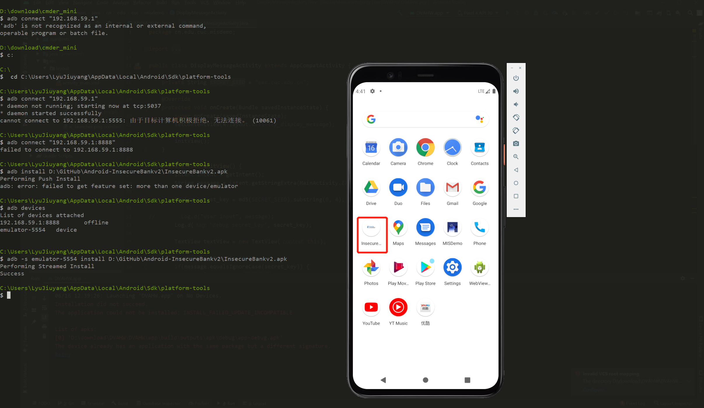

检测一下是否可以正常通信。默认的账号和密码是

```
jack/Jack@123$ 
dinesh/Dinesh@123$
```

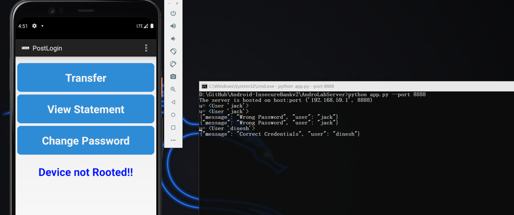

### 预处理

这里我遵从[参考三](#参考)的建议使用Android Killer，[下文](#关于android-killer)会简单介绍这个软件。

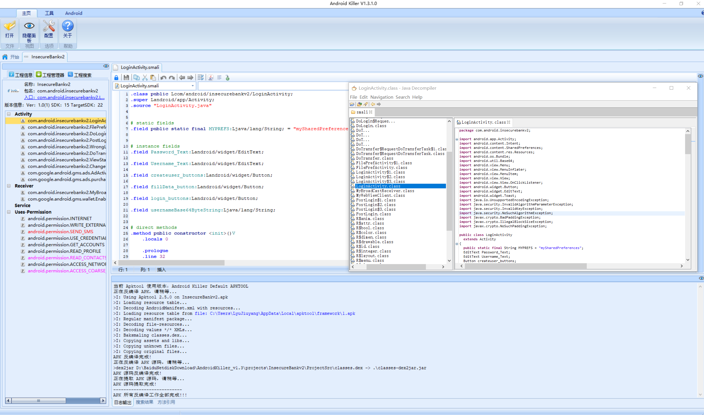


我们可以从日志文件中看出来，预处理进行的操作是，对apk文件进行了反编译（apktool）和对.dex文件转换成.class文件（dex2jar）。而图片右侧实现了将smali代码编译成java代码（jd-gui）。

### Developer Backdoor

经过预处理后，我们查看登录相关的文件，找到了如图所示代码：

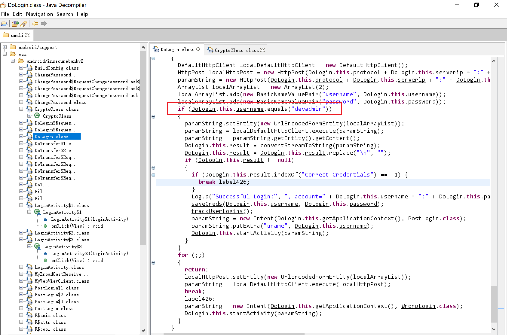

由于我使用的是 `jd-JUI` 而非 `jadx`，所以这里代码长得和[官方解决方案的代码](https://github.com/c4pr1c3/Android-InsecureBankv2/blob/master/Walkthroughs/Developer%20Backdoor.docx)有些不一样，但是实际逻辑是一样的。

测试发现，在使用 `devadmin` 后门账户时，不管输不输入密码都是可以进行登录的。


### Insecure Logging

通过查看 `adb logcat` 可以发现登录、修改密码时，都会把变化输出到日志文件中。

修改密码时：

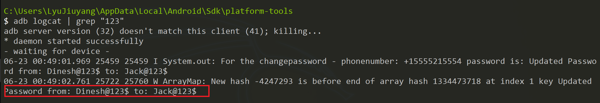

登录时：

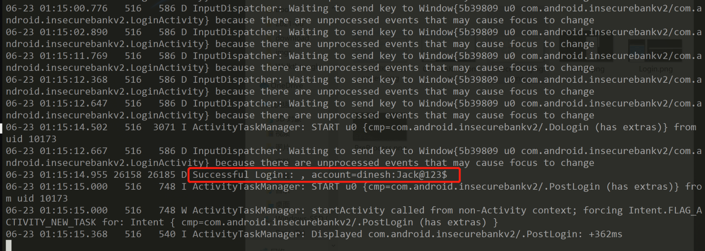

### Android Application patching + Weak Auth


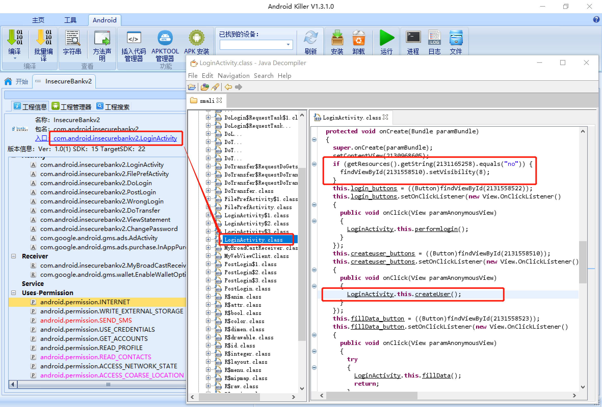

我们从整个文件的入口开始看起，发现是否添加 `CreateUserButton` 需要判断 `string(2131165258)`的值。

在 `R.class` 中找到这个ID代表的关键字。

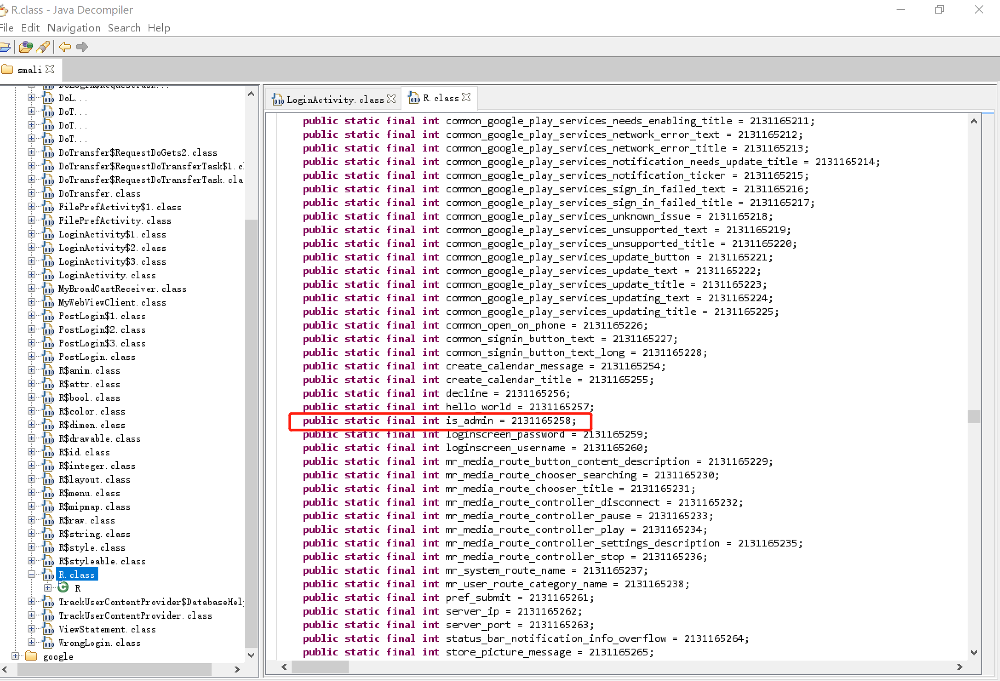

以 `is_admin` 为关键字进行搜索。

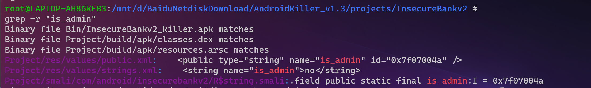

将`.../Project/res/values/strings.xml`中no修改为yes，进行重打包和重签名。命令行的方法同上一章作业，这里我们使用Android Killer自带的功能。

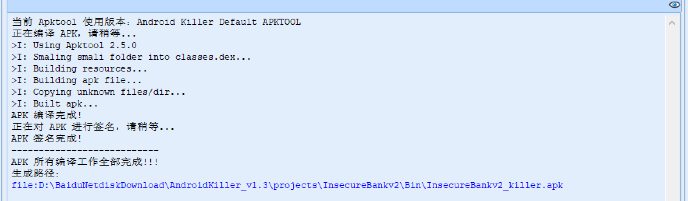

前后对比效果：

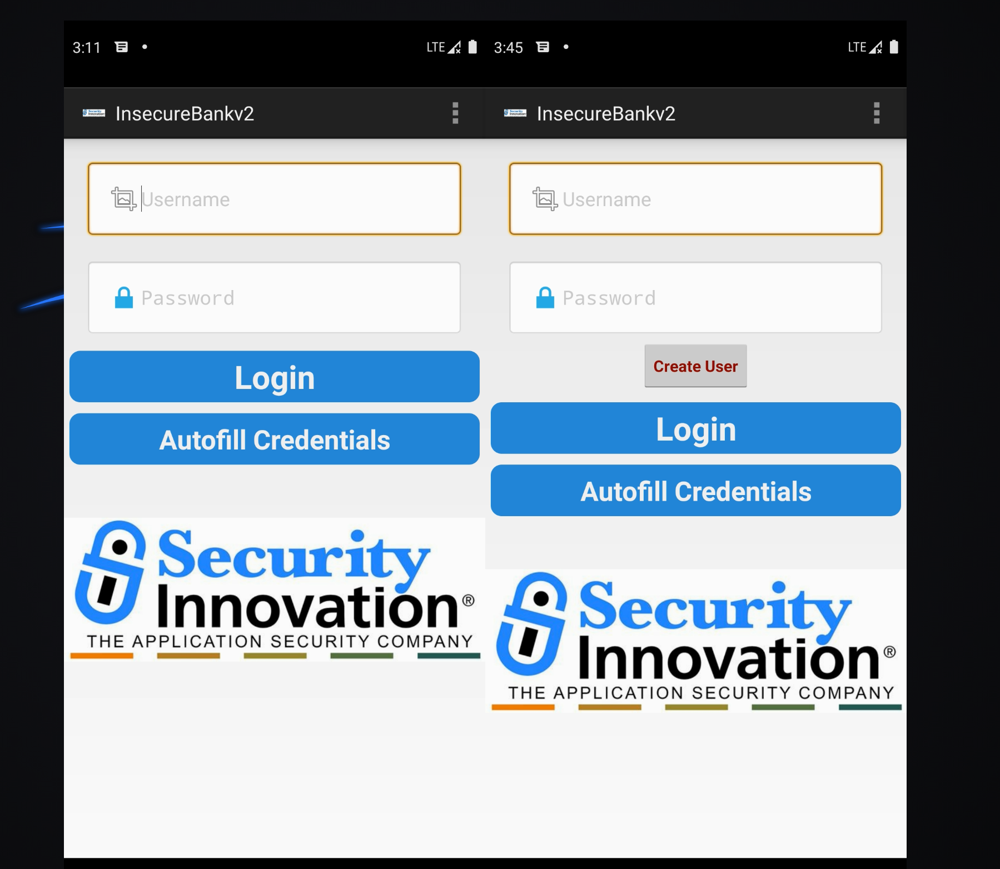

### Exploiting Android Broadcast Receivers

在逆向的代码中找到了 `Broadcast Receivers` 传递的参数。

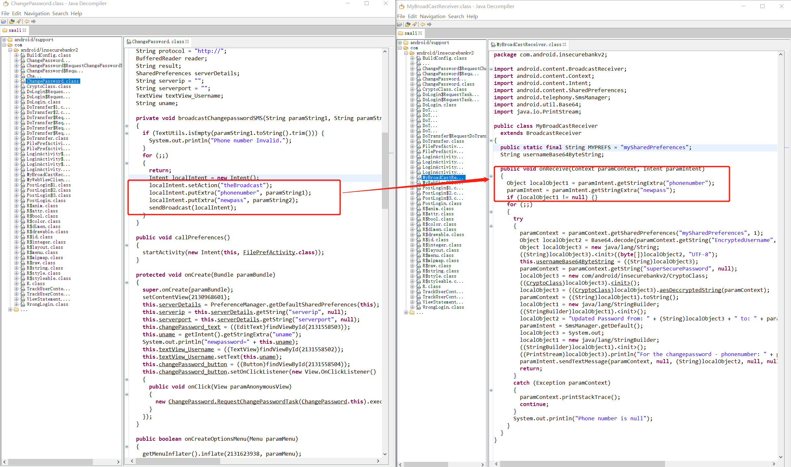

我们首先登录账号，之后在命令行中运行

```bash
adb shell am broadcast -a theBroadcast -n com.android.insecurebankv2/com.android.insecurebankv2.MyBroadCastReceiver --es phonenumber 5554 –es newpass Dinesh@123!
# Broadcasting: Intent { act=theBroadcast flg=0x400000 pkg=–es cmp=com.android.insecurebankv2/.MyBroadCastReceiver (has extras) }
# Broadcast completed: result=0
```
点开Message应用会发现多了一条短信。

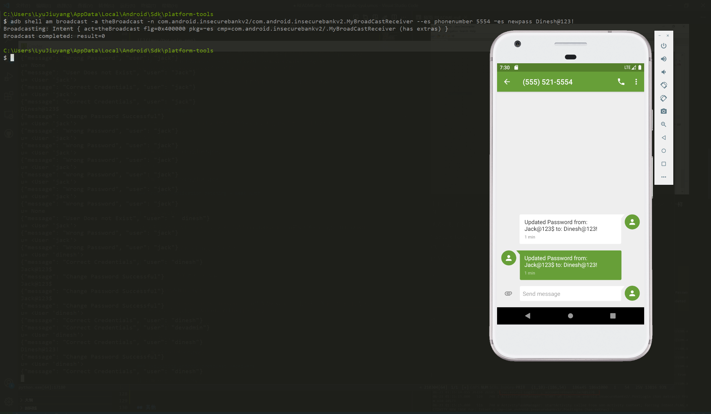


### Exploiting Android Content Provider

在反编译出的 `AndroidManifest.xml` 文件中可以找到 `TrackUserContentProvider`

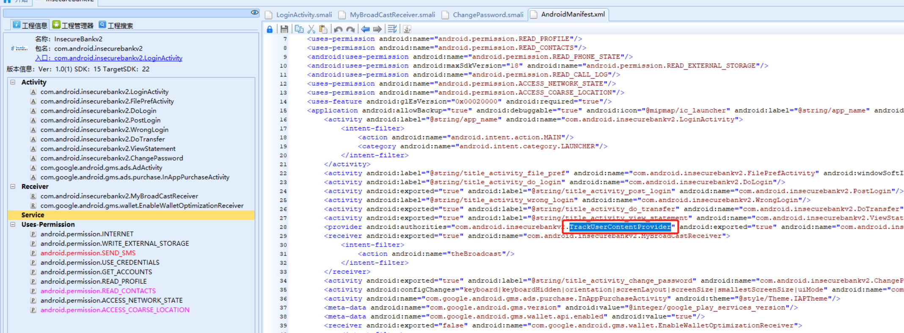

可以看到传递过来的参数（即登录的用户名）被插入了SQLLite数据库。

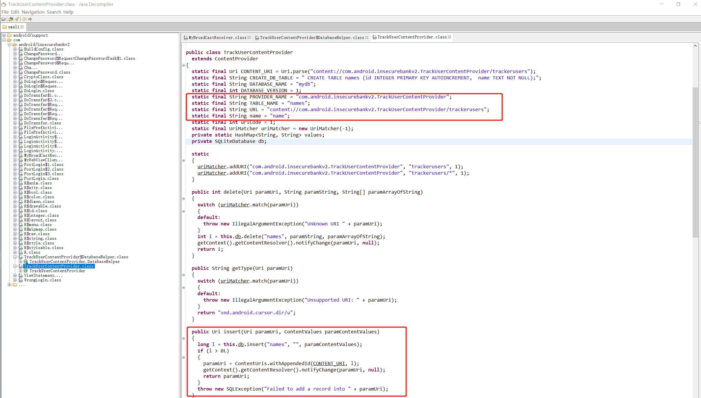

那我们使用多个账号登录之后，运行

```bash
adb shell content query --uri content://com.android.insecurebankv2.TrackUserContentProvider/trackerusers
```

可以发现登录的用户以明文形式存储在数据库中。（同时devadmin的登录记录优先级最高）

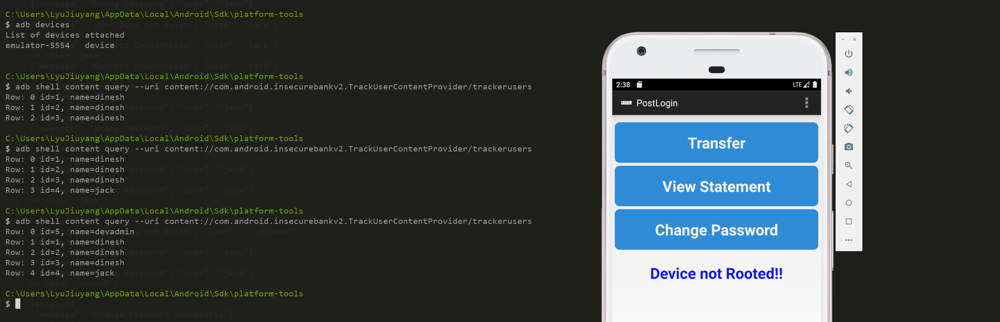

---

### **drozer子实验**

- 子实验环境：
  - Python 2.7
  - drover 2.4.4
  - JDK、SDK环境同本实验环境

由于drozer部分篇幅过长，独立列为[报告](Drozer.md)。

---

## 遇到的问题和解决

1. 长时间未关闭电脑和AVD，导致AVD桌面黑屏，底部导航栏消失。
   
   在重启无效的情况下，删除了原来的AVD并重新下载后正常。


## 其他

### 关于Android Killer

> Android Killer集合了之前讲过的Apktool、dex2jar、jd-gui、signapk、adb logcat等一系列工具，是目前笔者所使用过的Dalvik静态逆向平台中功能最全的一款。它在后续版本中将添加断点调试BakSmali代码的功能，并且完全免费，不足之处在于它是**闭源**软件，并且只支持Windows系统，使用Linux或Mac的读者可能需要寻找其他替代软件。
——《CTF特训营：技术详解、解题方法与竞赛技巧》

由于代码是完全闭源而且无法确定是不是官方来源，所以我在Windows沙盒中进行了试运行，凭借本人目前浅薄的知识，暂未发现恶意代码。

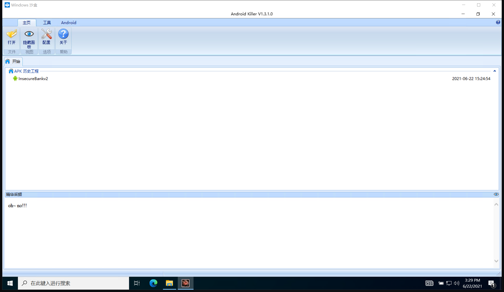

微软官网文档给出了沙盒运行的[必备条件](https://docs.microsoft.com/zh-cn/windows/security/threat-protection/windows-sandbox/windows-sandbox-overview#prerequisites)。

但是经过测试，该软件查看日志（logcat）搜索极其缓慢且易卡死，故所有涉及到日志的操作仍使用`adb logcat`。


## 参考

- [c4pr1c3 - GitHub - Android-InsecureBankv2](https://github.com/c4pr1c3/Android-InsecureBankv2)
- [c4pr1c3 - GitHub - MIS PPT](https://c4pr1c3.github.io/cuc-mis-ppt/chap0x08.md.html#/activity-phishing)
- [Rostik Slipetskyy - GitHub - Vulnerable Android Broadcast Receivers](https://oldbam.github.io/android/security/android-vulnerabilities-insecurebank-broadcast-receivers)
- [Hacktivities - InfoSec Write-ups - Android InsecureBankv2 Walkthrough: Part 1](https://infosecwriteups.com/android-insecurebankv2-walkthrough-part-1-9e0788ba5552)
- [FlappyPig - CTF特训营：技术详解、解题方法与竞赛技巧 - 第五篇：CTF之APK](https://book.douban.com/subject/35120456/)
- [周绪龙 - 知乎 - APP的安全性测试指南——测试工具Drozer](https://zhuanlan.zhihu.com/p/157219023)
- [StackOverflow - Windows cmd encoding change causes Python crash](https://stackoverflow.com/questions/878972/windows-cmd-encoding-change-causes-python-crash)
## 致谢

本课程所有作业结束，向这学期所有帮助过我的老师和师哥师姐们表示由衷感谢，无论是知识上的还是精神上的。

- [黄大](https://github.com/c4pr1c3)
- [谌师姐](https://github.com/chencwx)
- [揭师姐](https://github.com/YanhuiJessica)
- [紫紫师姐](https://github.com/purplezi)
- [夏教](https://github.com/xyw5vplus1)
- [id师姐](https://github.com/ididChan)